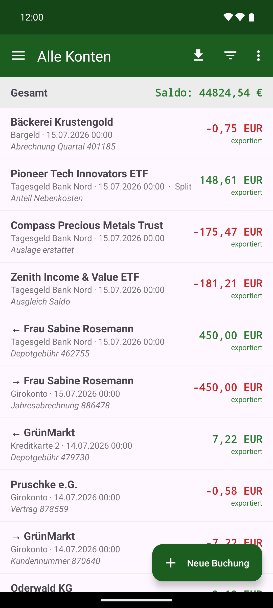
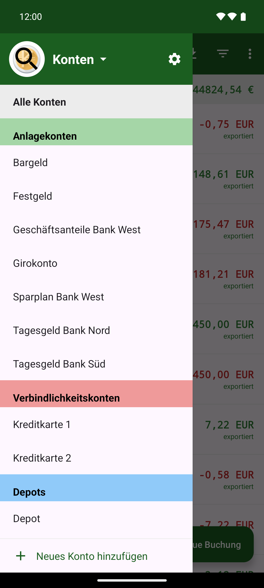

# KMySync

[English](README.md) · **Deutsch**

Eine mobile Ergänzung zu **[KMyMoney](https://kmymoney.org/)** (Android, Java). Erfasse Bargeld-Ausgaben,
-Einnahmen und Umbuchungen unterwegs direkt auf dem Smartphone oder einer Wear-OS-Uhr – und exportiere sie
nach KMyMoney, statt alles später von Hand nachzutragen.

> Offline-first · kein Konto, keine Werbung, kein Tracking · Open Source.

> [!NOTE]
> **KMySync hieß früher „Ausgaben".** Es ist dasselbe Programm, nur unter neuem Namen.
> Wer „Ausgaben" bereits installiert hat, spielt die neue Fassung einfach darüber – sie kommt als
> ganz normales Update: Paket-Kennung (`de.spahr.ausgaben`) und Signaturschlüssel bleiben gleich,
> deine Buchungen, Profile, Einstellungen und Belege bleiben also unangetastet. Es gibt nichts zu
> exportieren, zu deinstallieren oder zu übertragen. Nur der Name und die Beschriftung im
> App-Menü ändern sich.

📖 Das vollständige **[Benutzerhandbuch (PDF, Deutsch)](docs/Handbuch-KMySync-de.pdf)** beschreibt jede
Funktion im Detail, mit Bildschirmfotos.

<p>
  
  
  
  
</p>

## Warum die App für KMyMoney-Nutzer interessant ist

- 📲 **Mobile Erweiterung für KMyMoney** – Bargeldausgaben unterwegs sofort erfassen
- 🔌 **Nahtlose KMyMoney-Integration** über `.kmy`-Dateien oder CSV-Import
- 🗂️ **Sync über einen gemeinsamen WebDAV- oder SMB-Ordner** – eigener Server, eigene Daten
- 🔒 **Vollständig offline nutzbar** – keine zusätzliche Cloud, kein Herstellerkonto
- ⌚ **Wear-OS-App mit Spracheingabe** – Ausgabe direkt vom Handgelenk sprechen
- ➗ **Splitbuchungen und Umbuchungen**, Kategorien, Orte/Bestände und Depot-Import
- 📈 **Auswertungen**: Verlauf je Konto, Kategorien-Kreisdiagramm, Budget (Ist/Soll), Depot-Rendite
- 🌍 **Mehrsprachig** – Deutsch, Englisch und Spanisch eingebaut, weitere Sprachen per Übersetzungs-Upload
- 👆 **Biometrische Sperre**, verschlüsselte Zugangsdaten, Backup & Wiederherstellung
- 🆓 **Keine Werbung. Open Source.**

## Screenshots

<p>
  
  
  
  
  
  
  
  
</p>

## Download

Die aktuellen APKs findest du auf der **[Releases-Seite](../../releases/latest)**:

- **app-full-release.apk** – die Handy-App mit Wear-OS-Anbindung (Android 8 / API 26 und neuer)
- **app-foss-release.apk** – dieselbe Handy-App ohne Google Play Services (F-Droid-Variante)
- **wear-release.apk** – die Wear-OS-Uhren-App (gesprochene Ausgaben an die Handy-App). Nur nötig,
  wenn die Uhr die App nicht automatisch mit der Handy-Installation erhält; sonst separat auf die Uhr
  sideloaden.

Beide sind mit demselben Schlüssel signiert (Voraussetzung für die Wear-Data-Layer-Kopplung). Zum
Installieren „Unbekannte Quellen zulassen".

### Build-Flavors / F-Droid

Die Handy-App baut in zwei Varianten:

- **`full`** – mit der Wear-OS-Anbindung über Google Play Services (`./gradlew :app:assembleFullRelease`).
- **`foss`** – dieselbe App **ohne jegliches Google Play Services**
  (`./gradlew :app:assembleFossRelease`), gedacht für **F-Droid**. Alle Funktionen bleiben, nur die
  Wear-OS-Brücke fehlt.

Die Wear-OS-App (`:wear`) benötigt den Google Wear Data Layer und bleibt daher **GitHub-only**. Hinweise
zur F-Droid-Paketierung in [`fdroid/`](fdroid/).

## Funktionen im Überblick

Diese Liste nennt nur die Hauptfunktionen. Die genaue Bedienung, alle Feinheiten und Bildschirmfotos
stehen im **[Benutzerhandbuch](docs/Handbuch-KMySync-de.pdf)**.

- **Buchungen erfassen** – Ausgabe, Einnahme, Umbuchung, Splitbuchungen; eigene Rechentastatur im
  Betragsfeld.
- **Unterwegs ohne Tippen** – Spracheingabe („Frisör 20 €“) und stille Betrag-only-Erfassung: aus
  Standort und Betrag schlägt die App den Empfänger vor und füllt seine Kategorie vor. Empfänger lernt
  sie über Alias-Namen dazu.
- **Belege** – Foto oder PDF-Dokument je Buchung, mehrseitig, auch an einer Umbuchung. Fotos lassen
  sich zuschneiden und begradigen; alles wird in den Sync-Ordner hochgeladen. Die Belege einer
  gefilterten Auswahl lassen sich als ZIP-Datei mit sprechenden Namen ausgeben.
- **Liste & Filter** – Suche über Empfänger, Notiz und Kategorie, dazu Betrags-, Zeitraum- und
  Umkreisfilter; Rückgängig nach dem Löschen.
- **Konten ordnen** – Gliederung nach Kontenart, dazu frei vergebene Kontengruppen (auch aus der `.kmy`
  übernommene), freie Sortierung und Kontensuche.
- **Auswertungen** – Verlauf je Konto/Ort/gesamt, Kategorien-Kreisdiagramm, Budget (Ist/Soll) und
  geplante Buchungen als Vorschau.
- **Bestände & Depot** – mehrere Bargeld-Orte je Konto mit Kassensturz; Depot-Import mit Kurshistorie,
  Käufen, Verkäufen, Dividenden und Gewinn/Verlust.
- **Geplante Buchungen** – aus KMyMoney übernommen, einzeln buchbar oder überspringbar; die Regel
  wandert beim nächsten Export eine Periode weiter.
- **Synchronisierung** – Nextcloud/WebDAV/SMB, `.kmy`-Modus (direktes Lesen und Schreiben der
  KMyMoney-Datei) oder CSV; automatische Sicherung vor jedem Export. Nachträglich geänderte Buchungen
  werden in der Datei geändert statt doppelt angelegt. Die **Stichwörter** aus KMyMoney werden gelesen,
  bearbeitet, gefiltert und zurückgeschrieben.
- **Wear OS** – gesprochene Ausgabe direkt vom Handgelenk, auch offline; die Uhr nimmt nur den Text auf,
  gebucht wird auf dem Handy. Offline erfaßtes wird nachgereicht, ohne Verlust und ohne Dopplung.
- **Sicherheit & Sicherung** – optionale biometrische Sperre, GPS standardmäßig aus, verschlüsselte
  Zugangsdaten; Sicherung von Daten und Einstellungen in eine (auf Wunsch verschlüsselte) Datei.
- **Darstellung & Sprache** – helles und dunkles Design, app-weite Schriftgröße, Deutsch, Englisch und
  Spanisch eingebaut, weitere Sprachen per Übersetzungsdatei.

## CSV-Format (Export)

Spaltentrenner (`;` oder `,`) und Dezimaltrennzeichen (Komma oder Punkt) folgen den Einstellungen, Datum
`TT.MM.JJJJ`, UTF-8, CRLF. Splitbuchungen werden je Kategorie als eigene Zeile geschrieben. Der Import ist
sprachunabhängig: Er liest KMyMoney-Ledger-Exporte in jeder Sprache (Deutsch, Englisch, …) und
re-importiert den App-eigenen Export.

```
Datum;Empfänger;Konto;Typ;Betrag;Notiz;Kategorie
29.06.2026;Metzgerei;Bargeld;Ausgabe;-7,30;Mittagessen;Lebensmittel
```

## Technik

**Rahmen.** Reines Java 17, kein Kotlin. Gradle 8.9 / AGP 8.7.3, `compileSdk` und `targetSdk` 34,
`minSdk 26` (`:app`) bzw. `minSdk 30` (`:wear`). Zwei Module: `:app` (Handy, rund 180 Quelldateien) und
`:wear` (Uhr, rund 15). Kein Dependency-Injection-Rahmenwerk, keine Reflexion auf App-Code, keine
Analyse-, Absturz- oder Werbe-Bibliothek.

**Aufbau.** Die Pakete unter `de.spahr.ausgaben` schneiden nach Aufgabe: `db` (Room und Rechenlogik),
`export` (KMyMoney und CSV), `net` (WebDAV/SMB), `receipt` (Belege), `voice` (Sprach-Erfassung),
`location`, `security`, `settings`, `backup`, `i18n`, `notify`, `widget`, `wear` und `ui`.

**Datenhaltung.** [Room](https://developer.android.com/training/data-storage/room) über SQLite,
Datenbankfassung 44 mit lückenloser Migrationskette – ein Update behält den Bestand, ein
Neuinstallieren ist nie nötig. Beträge liegen durchgehend als `long` in Cent, nie als Fließkommazahl.

**KMyMoney.** Die `.kmy`-Datei ist gzip-gepacktes XML und wird direkt gelesen **und geschrieben** –
samt Splits, Umbuchungen, Depot und geplanten Buchungen. Geschrieben wird in den vorhandenen Baum
hinein (gleiche Transaktions-Kennungen an gleicher Stelle), damit KMyMoney die Datei unverändert
weiterverwendet; vor jedem Schreiben legt die App eine Sicherung an. Wird eine bereits uebertragene
Buchung geaendert, bleiben die dateiseitigen Angaben stehen, die die App nicht fuehrt (Abgleich-Status,
Aktion, Bankimport). Zurückgeschrieben wird nie über die
vorhandene Datei: `SafeReplace` legt den neuen Stand vollständig als Zwischendatei ab und läßt ihn den
Server anschließend an deren Stelle setzen (WebDAV `MOVE` bzw. SMB-`rename`, serverseitig unteilbar) –
bricht die Übertragung ab, bleibt die `.kmy` unverändert lesbar.

**Prüfbarkeit.** Alles, was rechnet oder entscheidet, steckt in reinen Klassen **ohne Android** –
`PayeeAmounts`, `PayeeCategories`, `AccountScope`, `BudgetMath`, `RadiusFilter`, `EditStatus`,
`NoteReceipt` und andere. Sie sind mit JUnit 4 ohne Emulator und ohne Mocks prüfbar; derzeit laufen
**844 Unit-Tests**, darunter Prüfungen gegen echte `.kmy`-Dateien (dafür Robolectric, das im APK nicht
landet).

**Belege.** Fotos und PDFs liegen app-privat und werden im Hintergrund nach `Belege/<Jahr>/` neben der
KMyMoney-Datei hochgeladen. Der Verweis darauf steht als Kürzel in der Buchungsnotiz und übersteht
damit Export und Neu-Import; ein PDF reicht die App über einen `FileProvider` an den Betrachter des
Geräts weiter. Wird ein Beleg geöffnet, der nicht auf dem Handy liegt, zeigt die App *„Wird geladen –
bitte warten"* und lädt ihn im Hintergrund nach (`Net.isOnline` plus gedeckelter Wiederholung in
`ReceiptSync.ensureLocalWaiting`); eine Fehlermeldung kommt nur ohne Verbindung. Bleibt er trotz
Verbindung unauffindbar, bietet die App an, den verwaisten Verweis zu entfernen, und setzt die Buchung
dabei auf „bearbeitet".

**Varianten.** Google Play Services stecken ausschließlich im `full`-Flavor unter `app/src/full/`; der
`foss`-Flavor enthält davon keine einzige Zeile. Handy- und Uhren-App brauchen dieselbe
`applicationId` **und** dieselbe Signatur, sonst findet der Data Layer sie nicht.

**Fremde Bibliotheken.** [Room](https://developer.android.com/training/data-storage/room), OkHttp
(WebDAV), [smbj](https://github.com/hierynomus/smbj) mit BouncyCastle (SMB2/3),
[MPAndroidChart](https://github.com/PhilJay/MPAndroidChart) – als Quellcode-Submodul, weil F-Droid
JitPack nicht zuläßt –, [osmdroid](https://github.com/osmdroid/osmdroid) (Karten-Auswahl ohne
API-Schlüssel), [androidx.security](https://developer.android.com/jetpack/androidx/releases/security)
(verschlüsselte Prefs),
[androidx.biometric](https://developer.android.com/jetpack/androidx/releases/biometric) sowie
[play-services-wearable](https://developer.android.com/training/wearables/data/data-layer) und
[androidx.wear.tiles](https://developer.android.com/training/wearables/tiles) – die letzten beiden nur
in `full` bzw. `:wear`.

## Bauen

```bash
./gradlew assembleDebug
```

Das Android-SDK wird über `local.properties` (`sdk.dir=…`) gefunden – diese Datei ist nicht
eingecheckt und muss lokal vorhanden sein (legt Android Studio automatisch an). Für einen signierten
Release-Build wird `keystore.properties` benötigt (ebenfalls nicht eingecheckt); fehlt sie, entsteht
ein unsigniertes Release.

## Sync-Ziel einrichten (Nextcloud / WebDAV / SMB)

In den Einstellungen den **Server-Typ** wählen, dann Basis-URL/Freigabe, Benutzername und Passwort
eintragen; ein Button **„Verbindung testen"** prüft die Verbindung. Ohne konfiguriertes Sync-Ziel wird
lokal in einen selbst gewählten Ordner exportiert.

- **Nextcloud**: Basis-URL des Servers + ein **App-Passwort** (Nextcloud → Sicherheit → App-Passwort).
- **WebDAV (generisch)**: vollständige DAV-Wurzel-URL, Auth per HTTP-Basic.
- **SMB/Samba**: ein **Einrichtungsassistent** sucht die Server im lokalen Netz, danach Freigabe und
  Zielordner durchklicken. SMB2/3, auch verschlüsselte, anonyme und DFS-Freigaben.
- **Diagnose**: „Verbindung testen" geht die ganze Kette bis zum Schreib-, Umbenenn- und Löschrecht
  durch und zeigt je Schritt Ergebnis, Dauer und Fehlercode. Der Bericht läßt sich kopieren und enthält
  weder Passwort noch Benutzernamen.

Alle Feinheiten – Ports, Gast-Zugänge, Domänen, Fehlerbilder – stehen im
**[Benutzerhandbuch](docs/Handbuch-KMySync-de.pdf)**.

## Lizenz

Veröffentlicht unter der **GNU General Public License v3.0** – siehe [LICENSE](LICENSE).

## Haftungsausschluss / Hinweis zum Entwicklungsprozess

Dieses Projekt wurde ursprünglich mit umfangreicher Unterstützung durch KI entwickelt.

Ich arbeite seit etwa 25 Jahren als Softwareentwickler, allerdings überwiegend in Technologien außerhalb des modernen Mobile-App-Umfelds. Obwohl ich Erfahrung mit Java habe und Teile des Quellcodes geprüft habe, kann ich nicht behaupten, jedes während der Entwicklung erzeugte Implementierungsdetail vollständig zu verstehen.

Die Anwendung wurde getestet und wird aktiv genutzt. Dennoch können Fehler, architektonische Schwächen oder Codebereiche vorhanden sein, die von Entwicklern mit mehr Android-spezifischer Erfahrung verbessert werden könnten.

Ich überprüfe den erzeugten Code kontinuierlich, erweitere mein Verständnis der Implementierung und entwickle das Projekt fortlaufend weiter. Code-Reviews, Fehlermeldungen, Verbesserungsvorschläge und Beiträge aus der Community sind daher ausdrücklich willkommen.
